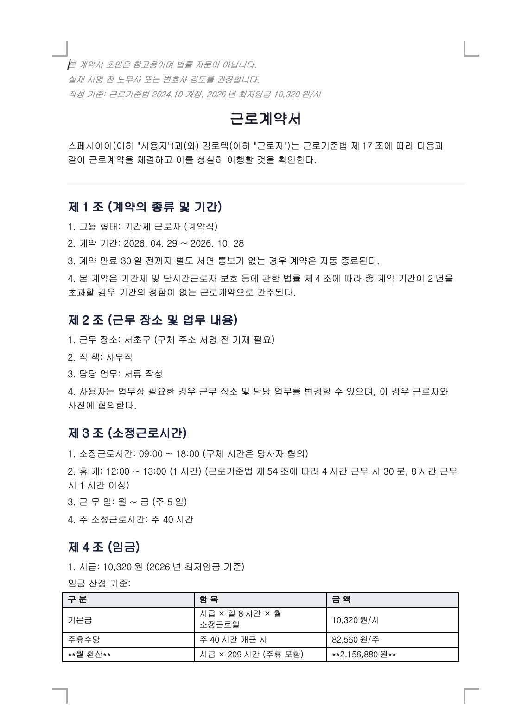

# korean-contracts

[](https://opensource.org/licenses/Apache-2.0)
[](https://claude.ai/code)
[](https://github.com/kimlawtech/korean-contracts)
[](https://modelcontextprotocol.io)
[](https://discord.gg/3gYGuMcqgb)

**한국 사업자를 위한 AI 계약서 자동 작성 도구**

창업자·HR 담당자·소상공인이 근로계약서, 알바계약서, 프리랜서 계약서, 외주용역계약서 등 8종의 계약서를 Claude Code에서 대화형으로 작성할 수 있는 스킬 모음입니다.
2026년 최저임금·최신 대법원 판례를 반영하고, RULE 1~14 법률 검증을 통과한 계약서 초안을 `.txt` + `.docx` 두 가지 형식으로 자동 생성합니다.

> 한국 법률 AI 허브 **SpeciAI**에서 만들고 있습니다.
> 계약·노동·투자·지재권을 AI로 해결하는 창업자·변호사 커뮤니티에 초대합니다.
> → [discord.gg/3gYGuMcqgb](https://discord.gg/3gYGuMcqgb) | [@kimlawtech](https://github.com/kimlawtech)

---

## 지원 계약서 8종

| 명령어 | 계약서 | 주요 대상 |
|--------|--------|-----------|
| `/korean-contracts` | 계약서 유형 진단 | 어떤 계약서가 필요한지 모를 때 |
| `/employment-contract` | 근로계약서 | 정규직·계약직, 5인이상/미만, 고정OT, 수습 |
| `/parttime-contract` | 알바·단시간 계약서 | 카페·편의점·일반, 주15시간 이상/미만 분기 |
| `/flexible-contract` | 유연근무 계약서 | 탄력근로·선택근로·재택·원격근무 |
| `/freelancer-contract` | 프리랜서 계약서 | 개인 프리랜서·1인 사업자, 3.3% 원천징수 |
| `/outsourcing-contract` | 외주용역계약서 | 법인 간 발주, 세금계산서, 불법파견 방지 |
| `/contract-amendment` | 근로조건 변경 합의서 | 임금·근무장소·업무내용·근무시간 변경 |
| `/salary-renewal` | 연봉계약서 | 연봉 갱신, 고정OT 포괄임금제 |
| `/daily-worker-contract` | 일용근로자 계약서 | 건설·행사·단기, 원천징수, 산재보험 |

---

## 계약서 생성 예시

아래는 `/employment-contract` 스킬이 실제로 생성한 근로계약서입니다.
인터뷰 응답만 입력하면 조항이 자동 완성되고, RULE 1~14 법률 검증을 거쳐 `.txt` + `.docx` 파일로 저장됩니다.



**이 화면에서 확인할 수 있는 것:**
- 법적 면책 고지 자동 삽입
- 근로기준법 §17 필수 5항목(계약기간·업무·근로시간·임금·휴가) 자동 구성
- 임금 구성 항목 분리 기재 (기본급 + 수당 + 합계)
- 최저임금 10,320원/시 자동 검증 (미달 시 계약서 생성 차단)
- 통상임금 재직조건부 상여금 포함 문구 (대법원 2024.12.19.)

---

## 핵심 기능

### 20년 경력 공인노무사·변호사 페르소나
각 계약 유형마다 전문 페르소나가 인터뷰를 진행합니다. 법적 리스크를 먼저 설명하고 사용자가 이해한 뒤 입력할 수 있게 안내합니다.

### RULE 1~14 자동 법률 검증
계약서 생성 전·후 14개 체크리스트를 자동 적용합니다.

| 검증 항목 | 내용 |
|-----------|------|
| RULE 1~5 | 근로기준법 §17 필수 5항목, 계약기간, 임금 구성 |
| RULE 6~9 | 해고예고, 서명란, 최저임금, 5인 분기 |
| RULE 10~11 | 면책 문구, 4대보험 |
| RULE 12 | 통상임금 재직조건부 상여금 (대법원 2024.12.19.) |
| RULE 13 | 임금명세서 교부 의무 (§48②) |
| RULE 14 | 위장 프리랜서 7대 요소 (대법원 2006다49830) |

### 기존 계약서 검토 및 개정법령 반영
사용 중인 계약서를 붙여넣으면 개정법령·최신 판례 기준으로 분석해 3단계로 분류된 검토 결과를 제공합니다.

| 단계 | 내용 |
|------|------|
| ❌ 위반 — 즉시 수정 | 최저임금 미달, 배우자 출산휴가 10일(구법) 등 현행법 위반 항목 |
| ⚠️ 개정법령 반영 필요 | 통상임금 재직조건부 상여금(2024.12.19.), 포괄임금 기본급 분리(2024.12.26.) 등 |
| 💡 개선 권고 | 위반은 아니지만 분쟁 예방을 위해 보완하면 좋은 항목 |

수정할 항목을 고르면 원본 조항을 최대한 유지하면서 선택 항목만 반영해 재작성합니다.

### 자동 분기 처리
- **5인 이상/미만** — 가산수당·공휴일 유급·연차·부당해고 조항 자동 분기
- **주 15시간 이상/미만** — 주휴수당·4대보험 가입 기준 자동 적용
- **계약직 갱신기대권 방지** — 기간제 계약서에 자동 삽입

### 최신 법령·판례 반영
- **2026년 최저임금 10,320원/시** 자동 검증 (미달 시 생성 차단)
- **대법원 2024.12.19.** — 재직조건부 상여금 통상임금 포함 (고정성 폐지)
- **대법원 2024.12.26.** — 포괄임금 최저임금 미달 부분 무효
- **배우자 출산휴가 20일** (남녀고용평등법 §18의2, 2025년 시행)
- **하도급법 2024.8.28.** — 기술자료 유용 5배 손해배상
- **임금명세서 교부 의무** (근로기준법 §48②, 과태료 100만원)

---

## 🔒 MCP 보안 서버 (v2.1 신규)

**가장 중요한 기능입니다.** 계약서에 들어가는 근로자 이름·주민번호·주소·급여는 민감 개인정보이므로 Claude·Anthropic 서버에 평문으로 노출되지 않아야 합니다.

본 패키지는 [Model Context Protocol (MCP)](https://modelcontextprotocol.io) 로컬 서버를 내장해 개인정보를 **토큰으로 마스킹**한 뒤 Claude에 전달하고, 최종 파일 저장 시에만 사용자 맥에서 복원합니다.

### 처리 흐름

```
[사용자 입력]
"홍길동 대표, 이직원 직원, 월 300만원"
         ↓
[MCP 마스킹 — 사용자 맥 로컬]
"PERSON_B, PERSON_A, AMOUNT_3M"
         ↓
[Claude가 보는 것 — 토큰만]
계약서 조항을 토큰 상태로 생성
         ↓
[MCP 저장 — 사용자 맥 로컬에서 복원]
실제 값 치환 → .txt + .docx 저장
```

### 무엇이 보호되는가

| 항목 | 마스킹 토큰 | 복원 위치 |
|------|-------------|-----------|
| 근로자·고용주 이름 | `PERSON_A`, `PERSON_B` | 로컬 세션 메모리 |
| 주민번호 앞 6자리 | `ID_FRONT` | 로컬 세션 메모리 |
| 주소 | `ADDRESS_A`, `ADDRESS_B` | 로컬 세션 메모리 |
| 급여·계약금액 | `AMOUNT_3M`, `AMOUNT_500K` | 로컬 세션 메모리 |
| 전화번호·사업자번호 | `CONTACT_A`, `BIZ_NO` | 로컬 세션 메모리 |

**세션 수명:** 계약서 저장 직후 자동 삭제. 프로세스 종료 시에도 삭제.

### 제공되는 MCP 도구 5종

| 도구 | 용도 |
|------|------|
| `mask_personal_info` | 변수 맵을 받아 개인정보를 토큰화, 세션에 원본 저장 |
| `save_contract` | 마스킹된 계약서 텍스트를 복원해 `.txt` + `.docx` 저장 |
| `load_contract_for_review` | 기존 계약서 파일 읽기 + 자동 마스킹 |
| `save_reviewed_contract` | 검토 후 수정된 계약서 복원 저장 |
| `list_sessions` | 활성 세션 목록 조회 (디버깅용) |

### MCP 서버 설치

```bash
# 1. Python 의존성 설치
pip install mcp python-docx

# 2. Claude Desktop 설정 파일에 서버 등록
# ~/Library/Application Support/Claude/claude_desktop_config.json
```

설정 파일 내용:

```json
{
  "mcpServers": {
    "korean-contracts": {
      "command": "python3",
      "args": ["/Users/<사용자>/Desktop/skill/korean-contracts/mcp-server/server.py"]
    }
  }
}
```

Claude Desktop을 재시작하면 MCP 서버가 자동 연결됩니다.

### MCP 서버 없이도 동작

MCP가 연결되지 않은 환경에서는 **플레이스홀더 모드**로 자동 전환됩니다. 민감 필드가 `[근로자 이름]`, `[기본급]` 형태의 대괄호로 표시되며, 사용자가 최종 파일에서 직접 기입하면 됩니다.

---

## 설치

### 요구 사항
- [Claude Code](https://claude.ai/code) 설치
- Git
- Python 3 (`.docx` 변환용, `python-docx` 패키지)

### 설치 명령

**macOS / Linux**

```bash
git clone https://github.com/kimlawtech/korean-contracts
cd korean-contracts
bash install.sh
```

**Windows (PowerShell)**

```powershell
git clone https://github.com/kimlawtech/korean-contracts
cd korean-contracts
powershell -ExecutionPolicy Bypass -File install.ps1
```

설치 스크립트가 자동으로 처리하는 것:
1. 각 스킬을 `~/.claude/skills/`에 심링크(macOS) 또는 Junction(Windows)으로 연결
2. Python 의존성 설치 (`mcp`, `python-docx`)
3. Claude Desktop 설정 파일에 MCP 서버 자동 등록
   - macOS: `~/Library/Application Support/Claude/claude_desktop_config.json`
   - Windows: `%APPDATA%\Claude\claude_desktop_config.json`

설치 후 **Claude Desktop을 완전히 종료 후 재실행**하면 MCP 서버가 자동 연결됩니다.

### 설치 경로 커스터마이즈

```bash
# macOS / Linux
CLAUDE_SKILLS_DIR=/your-project/.claude/skills bash install.sh
```

```powershell
# Windows
$env:CLAUDE_SKILLS_DIR="C:\your-project\.claude\skills"
powershell -ExecutionPolicy Bypass -File install.ps1
```

### Linux 사용자 안내

Linux는 현재 **Claude Desktop 미지원**입니다. 스킬 자체는 Claude Code CLI에서 사용 가능하지만, MCP 보안 서버는 작동하지 않으므로 플레이스홀더 모드로만 이용할 수 있습니다.

---

## 사용법

### 슬래시 명령어로 바로 시작

```
/korean-contracts         # 어떤 계약서가 필요한지 진단 (처음이면 여기서 시작)
/employment-contract      # 근로계약서
/parttime-contract        # 알바·단시간 계약서
/flexible-contract        # 유연근무 계약서
/freelancer-contract      # 프리랜서 계약서
/outsourcing-contract     # 외주용역계약서
/contract-amendment       # 근로조건 변경 합의서
/salary-renewal           # 연봉계약서
/daily-worker-contract    # 일용근로자 계약서
```

### 자연어로도 가능

```
"근로계약서 만들어줘"
"알바 계약서 필요해"
"프리랜서한테 맡기려는데 계약서 작성해줘"
"외주 계약서 만들어줘"
"연봉 인상했는데 계약서 갱신해줘"
"기존 계약서 검토해줘"
```

### 진행 흐름

```
1. 스킬 시작
2. 기존 계약서 여부 확인 (있으면 자동 분석)
3. 유형별 인터뷰 (1~2문항씩, 전문용어 풀어서 설명)
4. 입력 내용 요약 확인
5. RULE 1~14 법률 검증
6. .txt + .docx 파일 생성 및 저장
```

---

## 파일 구조

```
korean-contracts/
├── README.md
├── DISCLAIMER.md
├── install.sh                    macOS·Linux용 자동 설치
├── install.ps1                   Windows PowerShell용 자동 설치
│
├── korean-contracts/           ← /korean-contracts (진입점 라우터)
│   └── SKILL.md
│
├── employment-contract/        ← /employment-contract
│   └── SKILL.md
│
├── parttime-contract/          ← /parttime-contract
│   └── SKILL.md
│
├── flexible-contract/          ← /flexible-contract
│   └── SKILL.md
│
├── freelancer-contract/        ← /freelancer-contract
│   └── SKILL.md
│
├── outsourcing-contract/       ← /outsourcing-contract
│   └── SKILL.md
│
├── contract-amendment/         ← /contract-amendment
│   └── SKILL.md
│
├── salary-renewal/             ← /salary-renewal
│   └── SKILL.md
│
├── daily-worker-contract/      ← /daily-worker-contract
│   └── SKILL.md
│
├── assets/
│   └── sample-employment-contract.png
│
├── mcp-server/                 ← 🔒 개인정보 보호 MCP 서버
│   └── server.py                 마스킹·복원·저장 5개 도구
│
├── examples/
│   └── TEST-CASES.md             16개 테스트 시나리오
│
└── shared/                     ← 8개 스킬 공용 리소스
    ├── interview-all.md          유형별 인터뷰 질문 전체
    ├── render.md                 템플릿 치환 프로토콜
    ├── docx-generator.py         .docx 변환 스크립트
    ├── references/
    │   ├── labor-law-checklist.md    근로기준법 §17 + 5인 비교표
    │   ├── minimum-wage-2026.md      2026 최저임금 10,320원 기준
    │   ├── four-insurance.md         4대보험 가입 기준
    │   ├── legal-validation-rules.md RULE 1~14 법률 검증 체계
    │   ├── freelancer-tax.md         원천징수·위장프리랜서
    │   ├── outsourcing-law.md        도급·위임·불법파견
    │   ├── contract-glossary.md      전문용어 사전
    │   └── penalty-risks.md          위반 제재 표
    └── templates/
        ├── employment-contract.tmpl
        ├── parttime-contract.tmpl
        ├── flexible-contract.tmpl
        ├── freelancer-contract.tmpl
        ├── outsourcing-contract.tmpl
        ├── contract-amendment.tmpl
        ├── salary-renewal.tmpl
        └── daily-worker-contract.tmpl
```

---

## 왜 이 스킬을 만들었나

사업자·프리랜서·인사담당자가 계약서 한 장 쓰려면 법무 비용이 많이 들거나, 인터넷 템플릿을 구해도 **2026년 개정법령·대법원 최신 판례가 반영되지 않은 경우가 대부분**입니다.

이 스킬은 Claude Desktop에 한 번 설치하면:

- **9가지 계약 유형**을 대화만으로 작성
- **2026년 최저임금·통상임금·포괄임금 판례** 자동 반영
- **RULE 1~14 법률 검증** 자동 통과
- **개인정보 마스킹 MCP 서버**로 프라이버시 보호
- `.txt` + `.docx` 두 파일 자동 저장

5분 내외로 노무사 검토용 초안을 뽑을 수 있도록 만들었습니다.

**누가 쓰면 좋은가:**
- 직원을 처음 채용하는 스타트업 창업자
- 알바·프리랜서 계약이 잦은 소상공인
- 계약서 검토 업무가 반복되는 인사담당자
- 기존 계약서를 개정법령 기준으로 재검토해야 하는 노무사·변호사

---

## 기여하기

이 프로젝트는 커뮤니티 기여를 환영합니다.

- **버그 제보·기능 제안**: [Issues](https://github.com/kimlawtech/korean-contracts/issues) 에서 양식에 맞춰 등록
- **신규 계약 유형·법령 업데이트**: 전용 Issue 템플릿 제공
- **Pull Request**: [CONTRIBUTING.md](CONTRIBUTING.md) 규칙 준수 필수
- **커뮤니티 토론**: [Discord](https://discord.gg/3gYGuMcqgb)

### 커밋 메시지 규칙

```
[LABEL] 한국어 단문
```

라벨: `[ADD]` · `[FIX]` · `[UPDATE]` · `[REMOVE]` 4종만 사용.
자세한 규칙은 [CONTRIBUTING.md](CONTRIBUTING.md) 참고.

### 법률 관련 기여 주의사항

- 법령·판례 인용 시 **출처 명시 필수** (조문 번호·판례 번호)
- 예시 데이터는 **가명·가상 정보만** 사용 (실명·실주민번호 금지)
- **면책 문구 삭제 금지**

행동 강령: [CODE_OF_CONDUCT.md](CODE_OF_CONDUCT.md)

---

## 법적 면책

본 스킬이 생성하는 문서는 **참고용 초안**이며 법률 자문이 아닙니다.
실제 서명 전 반드시 공인노무사·변호사 검토를 받으세요.

---

## 커뮤니티 — SpeciAI

한국 법률 AI 허브 **SpeciAI** 디스코드에서 만나세요.
노동·계약·투자·지재권 법률 이슈를 AI와 함께 풀어가는 창업자·변호사 커뮤니티입니다.

**초대 링크**: [discord.gg/3gYGuMcqgb](https://discord.gg/3gYGuMcqgb)

이 프로젝트를 만들고 있습니다: [@kimlawtech](https://github.com/kimlawtech)
질문·기여·버그 제보를 환영합니다. Issue 또는 PR로 참여해주세요.

---

## License

**Apache License 2.0** — Copyright 2026 kimlawtech (SpeciAI).
